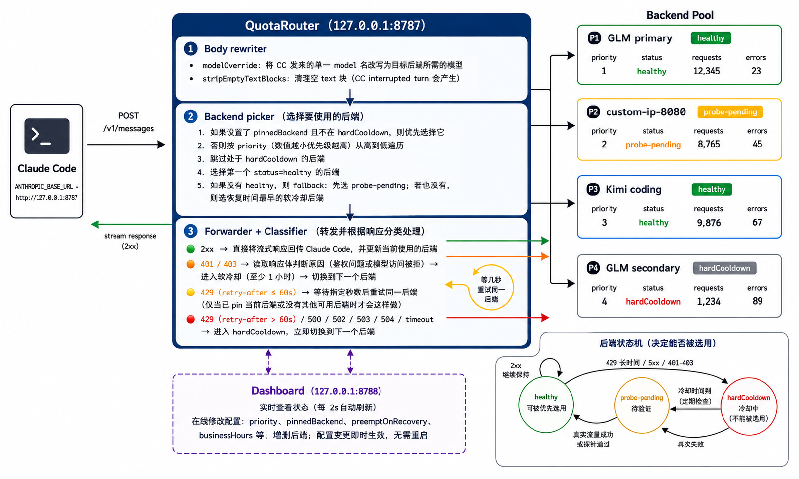

# QuotaRouter

QuotaRouter 是一个给 Claude Code 用的本地 API 路由器。

如果你手上有多个 Anthropic 兼容 API，比如不同套餐、不同供应商，甚至自建服务，平时最大的麻烦往往不是“能不能用”，而是：

* 这个额度没了，要手动换另一个
* 某个接口临时限流，又得改配置
* 高优先级线路恢复了，却不知道什么时候该切回来
* 为了保险，只能一直盯着几个服务的状态

QuotaRouter 做的事情很简单：**把这些CodingPlan的api都交给它，然后照常使用 Claude Code。**

它会优先使用你最想用的线路；遇到额度、限流或服务异常时，自动换到下一个可用的；原来的高优先级线路真正恢复后，再自动切回来。

## 你可以把它理解成

**Claude Code 前面的一层自动挡。**

平时不需要管它。

主线路能用，就一直走主线路；
主线路出问题，就自动换备用；
主线路恢复，就自动回来。

如果你临时想固定使用某个服务，也可以直接在 Dashboard 里切换，不需要重启。

## 适合什么情况

如果你：

* 同时有两三个以上 Claude / Anthropic 兼容 API
* 不想在额度耗尽以后手动改环境变量
* 有主力线路和备用线路
* 不同 API 的稳定性、额度或可用时间不一样
* 希望 Claude Code 尽量一直保持可用

那 QuotaRouter 基本就是为这个场景做的。

## 使用方式

安装并填好你的几个 API 后端，然后把 Claude Code 指向 QuotaRouter。

之后 Claude Code 仍然照常使用，线路选择和故障切换交给 QuotaRouter 处理。

同时会有一个本地 Dashboard，可以看到当前正在使用哪个服务、哪些线路暂时不可用，也可以随时调整顺序或手动指定线路。

## 它解决的核心问题

QuotaRouter 并不是为了让 API 变得更快，也不是把很多模型包装成一个新平台。

它只是解决一个很实际的问题：

> **我已经有好几个能用的 API 了，能不能别让我每天手动管它们？**

可以。

把它们排好优先级，剩下的交给 QuotaRouter。

## License

MIT
